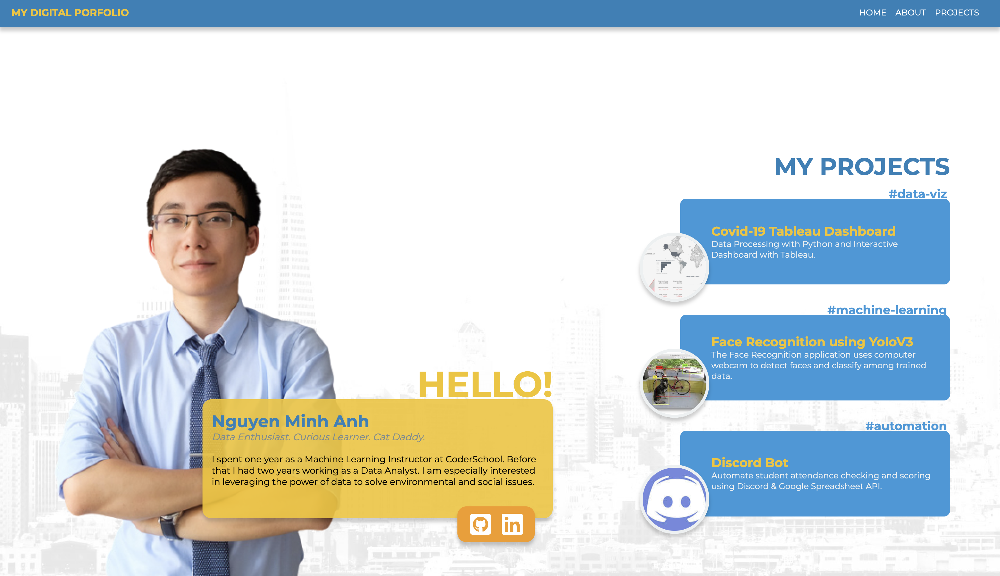
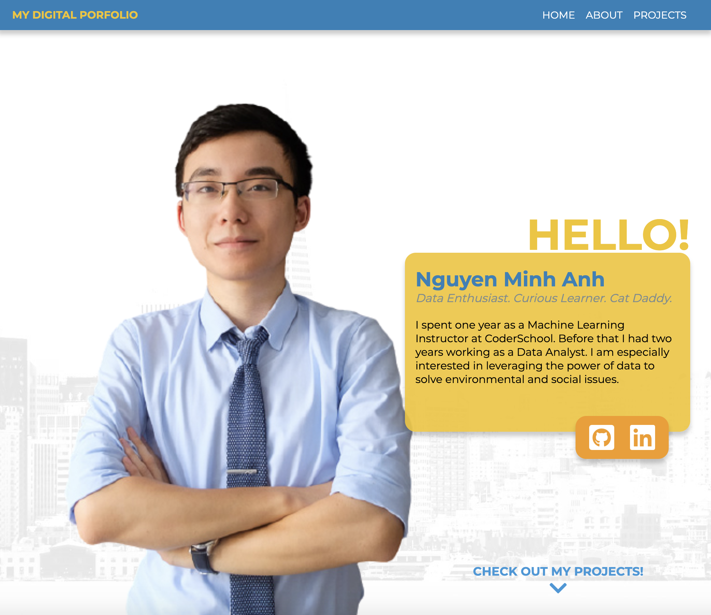
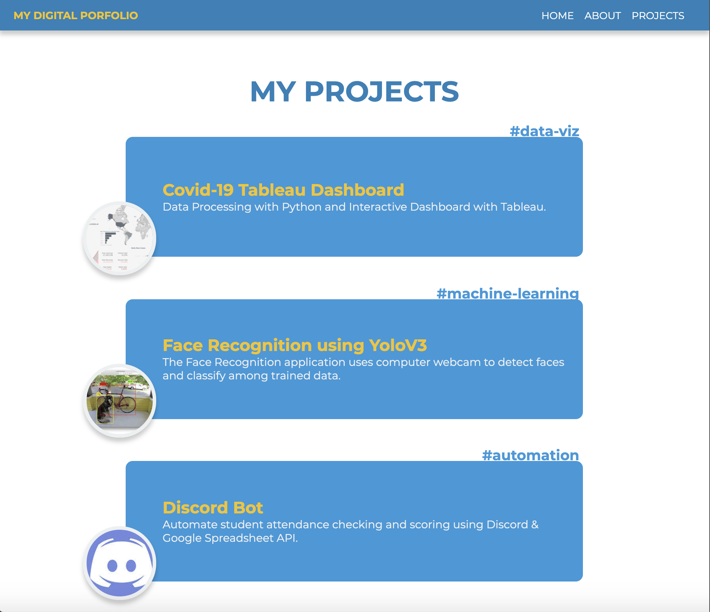
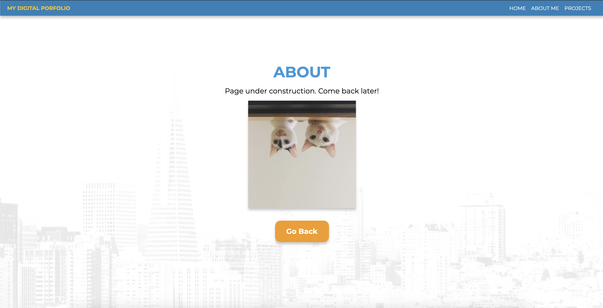

# Week 1 - Weekly project

## Requirements

- Build a website based on your own idea/ Duplicate an existing website using HTML & CSS

## Project Description

> **[See page on Netlify](https://mina-portfolio.netlify.app/)**

**Main Idea:**

Creating my own personal digital portfolio to showcase my past projects in Computer Science.

**What I Have Done:**

- Complete a Home Page for my Digital Porfolio using only HTML & CSS
- Make the page responsive i.e. scale & show/hide items in different screen sizes.
- Create and add links to empty About Me & My Projects pages.

**To-do**

- Complete About Me & My Projects pages
- (Optional) Add more details to Home Page

**Previews**

_Home Page - Full Screen_

_Home Page - max-width: 1000px_

_About Me Page - Full Screen_

