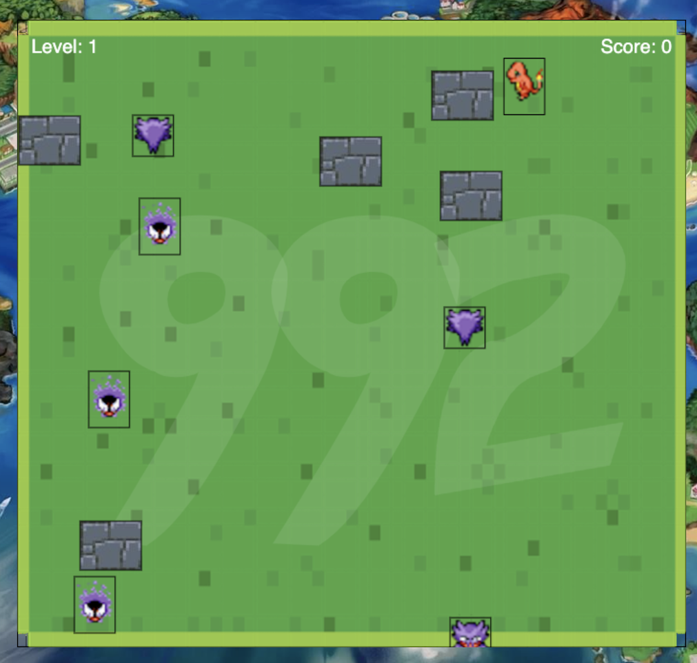

# Week 2 - Weekly project

## Requirements

- Build a canvas-based game using JavaScript.

## Project Description

> **[See page on Netlify]()**

**Name: Cuddly Charmander - The Amazing Coding Adventure**

**Main Idea:**

**Building my own video game based on _Nam, the Monster Hunter_ Game made by Charles Lee.**

Unlike Charles' Game, this game is divided into 20 levels, each requires 15 seconds to complete. In order to complete a level, the player has to control Charmander to defeat monsters around the map using his Fireballs, while avoiding to get hit by them. Charmander will encounter more challening enemies as he progresses, but he will also gain powerful upgrades to aid his adventure.

If the player fails to complete any level within the time limit, they will have to start again from the beginning! Spookyy!

**User Stories**

1. Game

- [x] Player can control Charmander using Arrow keys
- [x] Player can shoot/use other special skills with Charmander using different keys
- [x] Charmander can't move through wall/blocks
- [x] Charmander's shoots are blocked by wall/blocks
- [x] Charmander is stunned on hitting enemies
- [x] **Charmander evolves after at specified levels**
- [x] **There are three different types of enemies**
- [x] Enemy movement is randomized
- [x] Customized Styling: All game elements (except background) are replaced with Pokemon-themed objects
- [x] **Animated: Charmander and enemy's models (moving, getting hit, dead) are animated using sprite sheets**
- [x] **World Generation: Enemies and blocks are randomly spawn at the beginning of the level without overlapping**
- [x] Each level has a specified number of enemies per type and blocks spawn
- [x] Game ends if the timer at any round reaches zero. Player will have to start over
- [x] Player wins upon completing all 20 levels
- [x] Remaining time, current level and score are calculated and displayed on the game screen
- [x] **Game Menu: shows up at specified level to give instructions to player**
- [x] **Leaderboard: Player can see their high score on Leaderboard screen at the end of the game**
- [ ] Charmander & enemy hit boxes are correctly updated for different moving direction and level
- [ ] The user can hear sound effects upon movement and upon catching a monster.
- [ ] The user hears background music during the game.

2. Development

- [x] All game objects are organized and structured using Class
- [x] Project is documented and published on Github
- [x] The game can be played from the Internet (Netlify)
- [ ] High scores are saved to a server
- [ ] Have at least three code reviews from others.

## Code Reviews

This code was reviewed by @username and @otherusername.

- [Link to PR #X](#) - reviewed by @username.
- [Link to PR #Y](#) - reviewed by @otherusername.

## Time Spent and Lessons Learned

Time spent: **~40** hours spent in total.

**Lessons Learn**

- Organizing & managing a larger project
- Importing fonts to project
- Triggering different states in the continuously rendered game using Boolean variables
- Using `localStorage` to store data
- Practicing Asynchronus functions (`setTimeout()`)
- Practicing OOP (Class, instances, objects)
- Practicing using cache
- `this` vs. `super`
- Making animations using sprite sheets
- Reviewing Recursion
- `let` vs. `var` vs. `const`
- Different ways to declear a function
- `.map()` & `.filter()`

## Previews

_Opening Game Menu Screen_

_In-game Screen_

_Game End Screen_

_Leaderboard_

## Existing Problems

_Note: Following screenshots are taken in debug mode_

- Some character models' hit boxex are not correct. This is due the inconsistency in the image cropping process from the avaiable sprite sheet.

_Picture: Hit boxes of level 1 Charmander when moving left/right and the enemies don't fit with the model's graphics._

- Enemy random movements don't work very well in the bottom end of the screen. Reason: Under investigation.

_Picture: Enemy moving over the bottom of the screen._
